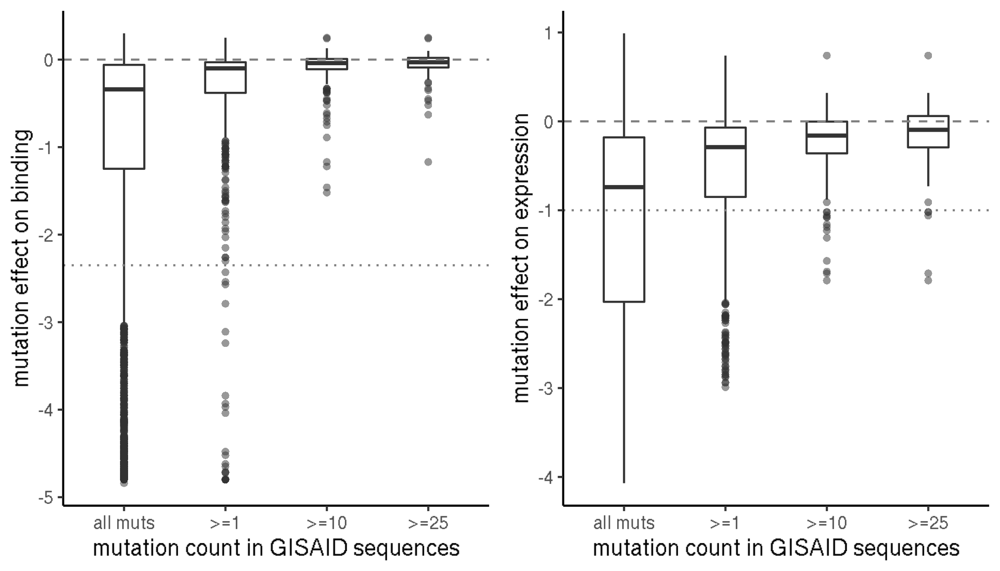

Custom analyses LY mAbs
================
Tyler Starr
2/6/2021

-   [Data input and formatting](#data-input-and-formatting)
-   [Part 1: Circulating variants at the per-mut
    level](#part-1-circulating-variants-at-the-per-mut-level)
-   [Part 2: Distribution of functional effects of mutations circulating
    at different
    levels](#part-2-distribution-of-functional-effects-of-mutations-circulating-at-different-levels)
-   [Part 3: escape within or without the structural
    epitope](#part-3-escape-within-or-without-the-structural-epitope)

This notebook does some random analyses on the clinical antibodies set
that vary from the more constrained global pipeline.

    require("knitr")
    knitr::opts_chunk$set(echo = T)
    knitr::opts_chunk$set(dev.args = list(png = list(type = "cairo")))

    #list of packages to install/load
    packages = c("yaml","data.table","tidyverse","ggrepel","bio3d","gridExtra")
    #install any packages not already installed
    installed_packages <- packages %in% rownames(installed.packages())
    if(any(installed_packages == F)){
      install.packages(packages[!installed_packages])
    }
    #load packages
    invisible(lapply(packages, library, character.only=T))

    #read in config file
    config <- read_yaml("./config.yaml")

    #read in escape profiles file
    profiles_config <- read_yaml(file=config$escape_profiles_config)

    #make output directory
    output_dir <- config$custom_plots_dir
    if(!file.exists(output_dir)){
      dir.create(file.path(output_dir))
    }

Session info for reproducing environment:

    sessionInfo()

    ## R version 3.6.2 (2019-12-12)
    ## Platform: x86_64-pc-linux-gnu (64-bit)
    ## Running under: Ubuntu 18.04.4 LTS
    ## 
    ## Matrix products: default
    ## BLAS/LAPACK: /app/software/OpenBLAS/0.3.7-GCC-8.3.0/lib/libopenblas_haswellp-r0.3.7.so
    ## 
    ## locale:
    ##  [1] LC_CTYPE=en_US.UTF-8       LC_NUMERIC=C              
    ##  [3] LC_TIME=en_US.UTF-8        LC_COLLATE=en_US.UTF-8    
    ##  [5] LC_MONETARY=en_US.UTF-8    LC_MESSAGES=en_US.UTF-8   
    ##  [7] LC_PAPER=en_US.UTF-8       LC_NAME=C                 
    ##  [9] LC_ADDRESS=C               LC_TELEPHONE=C            
    ## [11] LC_MEASUREMENT=en_US.UTF-8 LC_IDENTIFICATION=C       
    ## 
    ## attached base packages:
    ## [1] stats     graphics  grDevices utils     datasets  methods   base     
    ## 
    ## other attached packages:
    ##  [1] gridExtra_2.3     bio3d_2.4-0       ggrepel_0.8.1     forcats_0.4.0    
    ##  [5] stringr_1.4.0     dplyr_0.8.3       purrr_0.3.3       readr_1.3.1      
    ##  [9] tidyr_1.0.0       tibble_3.0.2      ggplot2_3.3.0     tidyverse_1.3.0  
    ## [13] data.table_1.12.8 yaml_2.2.0        knitr_1.26       
    ## 
    ## loaded via a namespace (and not attached):
    ##  [1] tidyselect_1.1.0 xfun_0.11        haven_2.2.0      colorspace_1.4-1
    ##  [5] vctrs_0.3.1      generics_0.0.2   htmltools_0.4.0  rlang_0.4.7     
    ##  [9] pillar_1.4.5     glue_1.3.1       withr_2.1.2      DBI_1.1.0       
    ## [13] dbplyr_1.4.2     modelr_0.1.5     readxl_1.3.1     lifecycle_0.2.0 
    ## [17] munsell_0.5.0    gtable_0.3.0     cellranger_1.1.0 rvest_0.3.5     
    ## [21] evaluate_0.14    parallel_3.6.2   fansi_0.4.0      broom_0.7.0     
    ## [25] Rcpp_1.0.3       scales_1.1.0     backports_1.1.5  jsonlite_1.6    
    ## [29] fs_1.3.1         hms_0.5.2        digest_0.6.23    stringi_1.4.3   
    ## [33] grid_3.6.2       cli_2.0.0        tools_3.6.2      magrittr_1.5    
    ## [37] crayon_1.3.4     pkgconfig_2.0.3  ellipsis_0.3.0   xml2_1.2.2      
    ## [41] reprex_0.3.0     lubridate_1.7.4  assertthat_0.2.1 rmarkdown_2.0   
    ## [45] httr_1.4.1       rstudioapi_0.10  R6_2.4.1         compiler_3.6.2

Data input and formatting
-------------------------

Read in escape fractions, rename some things to make them easier to work
with.

    scores <- data.table(read.csv(file=config$escape_fracs,stringsAsFactors=F))

    scores <- scores[selection %in% names(profiles_config$`LY_cocktail`$conditions) & library=="average", .(selection,condition,site,protein_site,wildtype,mutation,mut_escape_frac_epistasis_model,site_total_escape_frac_epistasis_model)]

    setnames(scores,"mut_escape_frac_epistasis_model","mut_escape_frac");setnames(scores,"site_total_escape_frac_epistasis_model","site_total_escape")

    scores[,antibody:=as.character(profiles_config$`LY_cocktail`$conditions[condition])]

    scores <- scores[,.(antibody,site,protein_site,wildtype,mutation,mut_escape_frac,site_total_escape)]

    scores[,site_max_escape:=max(mut_escape_frac,na.rm=T),by=c("antibody","site")]

Part 1: Circulating variants at the per-mut level
-------------------------------------------------

Current notebook on circulating mutations considers all mutations at a
site together, regardless of the escape conferred by the particular
mutation that is circulating. Make plots at the per-mut level.

We read in table reporting circulating variants. We add new columns to
our data frame indicating the nobs and frequency on GISAID, and the
number of countries in which a mutant has been observed. Then, for each
antibody, we plot per-mutation escape fraction versus frequency (log10),
with a ‘pseudo-frequency’ of 0.1x the lowest actual frequency, to enable
log10 plotting)

    #read in table giving mutant frequencies on GISAID
    counts <- read.csv(config$gisaid_mutation_counts,stringsAsFactors=F)
    #add to scores table
    scores[,count:=0];scores[,n_countries:=0];scores[,frequency:=0]
    for(i in 1:nrow(counts)){
      scores[protein_site==counts[i,"site"] & mutation==counts[i,"mutant"],count:=counts[i,"count"]]
      scores[protein_site==counts[i,"site"] & mutation==counts[i,"mutant"],n_countries:=counts[i,"n_countries"]]
      scores[protein_site==counts[i,"site"] & mutation==counts[i,"mutant"],frequency:=counts[i,"frequency"]]
    }

    #set factor order for antibodies
    scores$antibody <- factor(scores$antibody,levels=c("LY-CoV555","LY-CoV016","LY-CoV555+LY-CoV016"))

    scores[,pseudo_frequency:=frequency]
    scores[frequency==0,pseudo_frequency:=0.1*min(scores[frequency>0,frequency])]

    p1 <- ggplot(scores)+aes(x=pseudo_frequency,y=mut_escape_frac)+
      geom_point(shape=16, alpha=0.5, size=2.25)+
      facet_wrap(~antibody,nrow=1)+
      scale_x_continuous(trans="log10")+
      scale_y_continuous(limits=c(0,1.05))+
      theme_classic()+
      xlab('mutant frequency on GISAID (log10 scale)')+
      ylab('mutant escape fraction')+
      geom_text_repel(aes(label=ifelse((mut_escape_frac>0.15 & frequency>1e-6) | (mut_escape_frac>0.05 & frequency>1e-3),as.character(paste(wildtype,protein_site,mutation,sep="")),'')),size=3,color="gray40")
    p1

    invisible(dev.print(pdf, paste(output_dir,"/circ-mut-scatter_mAbs_LY.pdf",sep="")))

Part 2: Distribution of functional effects of mutations circulating at different levels
---------------------------------------------------------------------------------------

For contextualizing ACE2 and expression deficits of antigenic mutations,
what is the distribution of these phenotypes among sequences on GISAID?

    #read in DMS scores
    dms <- data.table(read.csv(file=config$mut_bind_expr,stringsAsFactors = F))
    setnames(dms,"site_SARS2","site")
    dms <- dms[mutant != "*",]
    dms <- dms[as.character(wildtype) != as.character(mutant),]

    dms[,count:=0]
    for(i in 1:nrow(counts)){
      dms[site==counts[i,"site"] & mutant==counts[i,"mutant"],count:=counts[i,"count"]]
    }

    #define factor for different nobs cutoffs, and collate into long data table for plotting
    muts_temp <- dms
    muts_temp$nobs_indicator<-factor("all muts",levels=c("all muts",">=1", ">=10",">=25"))
    muts_temp_add0 <- dms[count>=1, ]
    muts_temp_add0$nobs_indicator<-factor(">=1",levels=c("all muts",">=1", ">=10",">=25"))
    muts_temp_add10 <- dms[count>=10, ]
    muts_temp_add10$nobs_indicator<-factor(">=10",levels=c("all muts",">=1", ">=10",">=25"))
    muts_temp_add25 <- dms[count>=25, ]
    muts_temp_add25$nobs_indicator<-factor(">=25",levels=c("all muts",">=1", ">=10",">=25"))

    muts_temp <- rbind(muts_temp,muts_temp_add0,muts_temp_add10,muts_temp_add25)
    muts_temp$nobs_indicator <- factor(muts_temp$nobs_indicator, levels=c("all muts",">=1", ">=10",">=25"))

    set.seed(198)
    p1 <- ggplot(muts_temp[!is.na(muts_temp$bind_avg),],aes(x=nobs_indicator,y=bind_avg))+
      geom_boxplot(outlier.shape=16, width=0.4, outlier.alpha=0.5)+
      #geom_jitter(width=0.2, alpha=0.1, shape=16)+
      xlab("mutation count in GISAID sequences")+ylab("mutation effect on binding")+
      theme_classic()+geom_hline(yintercept=-2.35, linetype = 'dotted', col = 'gray50')+
      geom_hline(yintercept=0,linetype='dashed',col='gray50')

    p2 <- ggplot(muts_temp[!is.na(muts_temp$expr_avg),],aes(x=nobs_indicator,y=expr_avg))+
      geom_boxplot(outlier.shape=16, width=0.4, outlier.alpha=0.5)+
      #geom_jitter(width=0.2, alpha=0.1, shape=16)+
      xlab("mutation count in GISAID sequences")+ylab("mutation effect on expression")+
      theme_classic()+geom_hline(yintercept=-1, linetype = 'dotted', col = 'gray50')+
      geom_hline(yintercept=0,linetype='dashed',col='gray50')

    grid.arrange(p1,p2,ncol=2)

    invisible(dev.print(pdf, paste(output_dir,"/distribution-ACE2-expr-dms_v_nobs-GISAID.pdf",sep="")))

Part 3: escape within or without the structural epitope
-------------------------------------------------------

We want to try a few plots – at the per-mut and per-site level, compare
distribution of escape scores between structural contacts and
non-contacts. We should try the contact/non-contact, but also a “close”
category corresponding to 4-8A distance? Means we’ll probably want to
re-do the structural analysis here within this “custom analyses” script.

First, load pdbs, and generate list of residues that are &lt;4A or 4-8A
from each mAb

    pdb_LY555 <- read.pdb(file="./data/pdbs/7kmg_single.pdb")

    ##    PDB has ALT records, taking A only, rm.alt=TRUE

    pdb_LY016 <- read.pdb(file="./data/pdbs/7c01_single.pdb")

    contacts_LY555_4A <- binding.site(pdb_LY555, 
                                          a.inds=atom.select(pdb_LY555, chain="C"),
                                          b.inds=atom.select(pdb_LY555,chain=c("A","B")),
                                          cutoff=4,hydrogens=F)$resno
    contacts_LY555_4to8A <- binding.site(pdb_LY555, 
                                          a.inds=atom.select(pdb_LY555, chain="C"),
                                          b.inds=atom.select(pdb_LY555,chain=c("B","D")),
                                          cutoff=8,hydrogens=F)$resno
    contacts_LY555_4to8A <- contacts_LY555_4to8A[!(contacts_LY555_4to8A %in% contacts_LY555_4A)]

    contacts_LY016_4A <- binding.site(pdb_LY016, 
                                          a.inds=atom.select(pdb_LY016, chain="A"),
                                          b.inds=atom.select(pdb_LY016,chain=c("H","L")),
                                          cutoff=4,hydrogens=F)$resno
    contacts_LY016_4to8A <- binding.site(pdb_LY016, 
                                          a.inds=atom.select(pdb_LY016, chain="A"),
                                          b.inds=atom.select(pdb_LY016,chain=c("H","L")),
                                          cutoff=8,hydrogens=F)$resno
    contacts_LY016_4to8A <- contacts_LY016_4to8A[!(contacts_LY016_4to8A %in% contacts_LY016_4A)]

Next, make jitterplots showing site total escape for the three
categories of structural class.

    temp <- scores[antibody %in% c("LY-CoV016","LY-CoV555"),]
    #add column whether a site is in direct contact, proximal, or distal to interface
    temp[,contact:="distal"]
    temp[antibody=="LY-CoV016" & protein_site %in% contacts_LY016_4A,contact:="contact"]
    temp[antibody=="LY-CoV016" & protein_site %in% contacts_LY016_4to8A,contact:="proximal"]
    temp[antibody=="LY-CoV555" & protein_site %in% contacts_LY555_4A,contact:="contact"]
    temp[antibody=="LY-CoV555" & protein_site %in% contacts_LY555_4to8A,contact:="proximal"]
    temp$contact <- factor(temp$contact,levels=c("contact","proximal","distal"))

    #add value indicating the heuristic cutoff for "strong" escape for each mAb
    cutoff_LYCoV016 <- max(5*median(temp[antibody=="LY-CoV016",site_total_escape]),0.05*max(temp[antibody=="LY-CoV016",site_total_escape]))
    cutoff_LYCoV555 <- max(5*median(temp[antibody=="LY-CoV555",site_total_escape]),0.05*max(temp[antibody=="LY-CoV555",site_total_escape]))

    temp[antibody=="LY-CoV016",cutoff:=cutoff_LYCoV016]
    temp[antibody=="LY-CoV555",cutoff:=cutoff_LYCoV555]

    #sitewise
    ggplot(unique(temp[,.(antibody,protein_site,site_total_escape,contact)]),aes(x=contact,y=site_total_escape))+
      geom_jitter(width=0.15, alpha=0.5,height=0,size=2.25,shape=16)+
      geom_hline(data=unique(temp[,.(antibody,cutoff)]),aes(yintercept=cutoff),linetype="dashed",color="gray50")+
      theme_classic()+
      theme(axis.text.x=element_text(angle=90,hjust=1))+
      xlab("structural context")+ylab("sitewise total escape")+
      facet_wrap(~antibody,nrow=1)

    invisible(dev.print(pdf, paste(output_dir,"/escape_by_contact_type.pdf",sep="")))

Table with number of sites in each structural category, and number of
sites of “strong” escape

    temp <- unique(temp[,.(antibody,protein_site,site_total_escape,contact,cutoff)])

    dt <- data.frame(antibody=c("LY-CoV555","LY-CoV016"),n_contact=NA,n_contact_escape=NA,n_proximal=NA,n_proximal_escape=NA,n_distal=NA,n_distal_escape=NA)
    for(i in 1:nrow(dt)){
      dt$n_contact[i] <- nrow(temp[as.character(antibody)==dt[i,"antibody"] & contact=="contact",])
      dt$n_contact_escape[i] <- nrow(temp[as.character(antibody)==dt[i,"antibody"] & contact=="contact" & site_total_escape>cutoff,])
      dt$n_proximal[i] <- nrow(temp[as.character(antibody)==dt[i,"antibody"] & contact=="proximal",])
      dt$n_proximal_escape[i] <- nrow(temp[as.character(antibody)==dt[i,"antibody"] & contact=="proximal" & site_total_escape>cutoff,])
      dt$n_distal[i] <- nrow(temp[as.character(antibody)==dt[i,"antibody"] & contact=="distal",])
      dt$n_distal_escape[i] <- nrow(temp[as.character(antibody)==dt[i,"antibody"] & contact=="distal" & site_total_escape>cutoff,])
    }
    kable(dt)

| antibody  | n\_contact | n\_contact\_escape | n\_proximal | n\_proximal\_escape | n\_distal | n\_distal\_escape |
|:----------|-----------:|-------------------:|------------:|--------------------:|----------:|------------------:|
| LY-CoV555 |         15 |                  7 |           3 |                   0 |       155 |                 2 |
| LY-CoV016 |         23 |                 15 |          23 |                   3 |       128 |                 1 |
